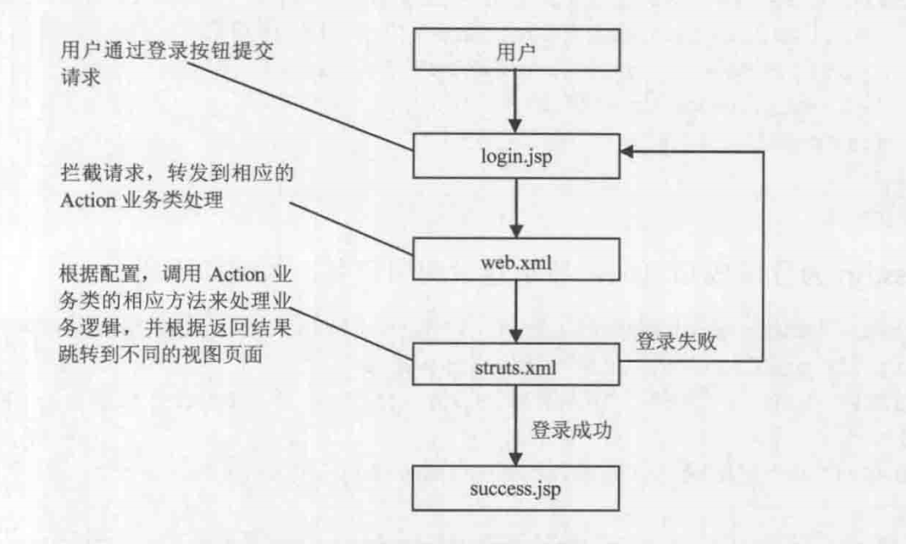

# learn struts
Struts2 Architechture and basic flow.Struts2 架构和基本流程。
## Architechture(整体架构)

- 橙色
  Servlet Filters 过滤器链，过滤器链对请求进行预先处理
- 浅蓝色
  Struts2 Core ,Struts2 核心部分
- 浅绿色
  Interceptors 拦截器，类似于Servlet中的filter。
- 浅黄色
  User created ，由开发人员创建，用来完成具体的任务。
### flow(执行流程)
1. 用户发起请求，Web容器接收到请求，将请求传递给一个标准的过滤器链，包括Action ContextCleanUp过滤器和其他过滤器。然后调用Struts2 的FitlerDispatcher(在2.1.3后，改成了StrutsPrepareAndExecuteFilter,即在web.xml中配置的Structs2核心控制器).
核心控制器调用ActionMapper,确定要调用的Action。
2. 雀帝你个要调用Action后，AcitonProxy获得控制权，ActionProxy调用ConfigurationManager读取配置文件，根据配置信息创建ActionInvocation,由Struts2开始处理请求。按配置文件，先后执行拦截器，控制器。
3. 控制器Action执行结束后，要返回一个字符串，ActionInvocation根据返回结果查找对用得Result ,然后执行Result
4. 拦截器再次被执行，顺序与执行Action前相反(和Servlet的Filter执行过程相似)，最后结果返回给web.xml中配置的过滤器。
### model detail (模块说明)
- #### FitlerDispatcher(StrutsPrepareAndExecuteFilter)
  Struts2的调度中心，mvc中的控制器，在web.xml进行配置。根据AcitonMapper返回的结果决定是否处理请求。
- #### ActionMapper
  判断HTTP请求是否需要由Struts2进行处理，如果需要，返回一个对象来描述请求对应的ActionInvocation。需要读取strus.xml的配置信息，查找HTTP请求和与之对用的Action
- #### ActionProxy
  位于Acion和xwork之间，可以用其他实现方式。
- #### ConfigurationManager
  相当于struts2在内存中的对应。
- #### struts.xml
  Struts2配置文件，负责Action的配置
- #### ActionInvocation
  真正调用并执行Action,拥有一个Acton实例和Action所依赖的拦截器实例，想当于Action控制器
- #### Action
  动作执行单元，处理请求，封装数据，确定返回结果。默认处理方法为execute(),相当于servlet中的doxxx方法。
- #### Result
  结果，Action执行后要跳转的页面，即MVC中的view
- #### Template
  模板
- #### Interceptors
  拦截器，用户处理请求和返回结果
- #### Tag Substem 标签库
### An simple Example(一个简单的执行流程实例)
以登录功能来展示Struts2的运行流程
### 登录流程
 
### 流程说明
1. 用户访问登录页面，填写信息，执行登录，向服务器提交登录信息
2. web容器读取web.xml,加载Struts2核心控制器，对用户请求进行拦截。
3. 在struts.xml 中读取Action 配置 ，找到名字为login的Action配置，把拦截的请求发给对应的LoginAciton动作进行处理。
4. 根据struts.xml中的配置文件，执行LoginAciton动作里相应的方法，如果没有配置要执行的方法，则默认执行execute().
5. 根据返回结果，在struts查找对应的视图文件。
### 登录实例
[详见代码](https://github.com/buniaowanfeng/LearnStruts2/tree/ch2)
## 基本配置
### web.xml配置
web.xml是所有Java Web应用程序都需要的核心文件。在Servlet应用中，需要配置在该文件中
配置Servlet,Filter ,Listener 等内容，在Struts2应用中，配置Struts2核心控制即可，其他配置在struts.xml
或其他struts配置文件中进行配置。
```xml
<?xml version="1.0" encoding="UTF-8"?>
<web-app version="2.4"
         xmlns="http://java.sun.com/xml/ns/j2ee"
         xmlns:xsi="http://www.w3.org/2001/XMLSchema-instance"
         xsi:schemaLocation="http://java.sun.com/xml/ns/j2ee http://java.sun.com/xml/ns/j2ee/web-app_2_4.xsd">

    <!-- 配置Struts 2框架的核心控制器 -->
    <filter>
        <!-- 配置Struts 2核心控制器的名字 -->
        <filter-name>struts2</filter-name>
        <!-- 配置Struts 2核心控制器的实现类 -->
        <filter-class>
            org.apache.struts2.dispatcher.ng.filter.StrutsPrepareAndExecuteFilter
        </filter-class>
    </filter>

    <!-- 配置 Struts 核心控制器的拦截规则-->
    <filter-mapping>
        <!-- 过滤器拦截名称-->
        <filter-name>struts2</filter-name>
        <!-- 配置拦截规则，拦截所有用户请求 -->
        <url-pattern>/*</url-pattern>
    </filter-mapping>
</web-app>
```
### strus.xml配置
Struts2的核心配置文件，主要负责管理Action，在idea中，struts2文件位于resources目录下。
#### classic confgiuration 典型配置文件
```xml
<?xml version="1.0" encoding="UTF-8" ?>
<!DOCTYPE struts PUBLIC
        "-//Apache Software Foundation//DTD Struts Configuration 2.3//EN"
        "http://struts.apache.org/dtds/struts-2.3.dtd">
<struts>
    <!--  定义常量 -->
    <constant name="constant name " value="constant value ">
    <!-- 包含的文件，可以包含其他action配置文件 -->
    <include file="file name " ></include>

    <!-- action配置文件  -->
    <package name="pacakge name " namespace="namespace name " extends="parent package name">
      <!--  配置action-->
      <action name="action name" class="class name ">
        <!-- 配置发牛结果 -->
        <result name="result">result</result>
      </action>

      <!-- 拦截器配置 -->
      <interceptors>
        <!-- 定义拦截器 -->
        <interceptor name=" interceptor name " class="interceptor class">
          <param name"param name">param value </param>
        </interceptor>
        <!--  定义拦截器栈-->
        <interceptor-stack name="name">
            <interceptor-ref name="name">
              <param name"param name">param value </param>
            </interceptor-ref>
        </interceptor-stack>
      </interceptors>
    </package>
    ...
</struts>
```
#### 节点说明
- constant
  配置常量元素，如Struts2的默认配置,常量加载顺序：struts-default.xml > struts-plugin.xml > struts.xml > struts.proerties > web.xml
- inclue
  包含其他配置文件，可以配置文件按模块划分，便于项目管理
- pacakge
  在Struts2中，Action，Result组合在一起成为一个逻辑单元，类似Java中的包。
  - name
    必须属性，指定包名称，不能重复
  - extends
    类似extends ,指定要继承的包
  - namespace
    可选属性，指定Action的命名空间，‘/’表示根命名空间，即web应用根目录，Struts2先在命名空间内查找Action，如果没找到，再去根目录查找。
- action
  工作单元，用于将请求URL和Action类对应。
  - name
    必须属性，指定Action在URL中的名字
  - class
    可选属性，指定Action类
- result
  返回结果
  - name  
    逻辑名，用于和Action返回的结果进行匹配
  - result 实际返回结果
- interceptors
  拦截器
### struts.proerties配置
定义Struts2的属性
