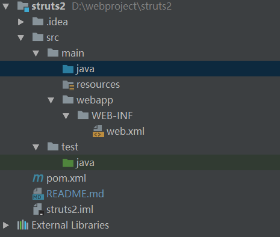

# learn struts
A simple Struts2 Web Application
## quick start
use maven ,idea to create a simple Struts2 Web Application
### dependence
- Servlet
Struts2 is based on servlet ,need import servlet
```xml
<!-- https://mvnrepository.com/artifact/javax.servlet/javax.servlet-api -->
<!-- servlet 依赖-->
 <dependency>
    <groupId>javax.servlet</groupId>
    <artifactId>servlet-api</artifactId>
    <version>2.5</version>
 </dependency>
```
- Struts2-core
the core library of struts2
```xml
<!-- https://mvnrepository.com/artifact/org.apache.struts/struts-core -->
<!-- struts2依赖-->
<dependency>
    <groupId>org.apache.struts</groupId>
    <artifactId>struts2-core</artifactId>
    <version>${struts2.version}</version>
</dependency>
```
- Struts2 tag lib
  Struts2 tags
```xml
<!-- https://mvnrepository.com/artifact/org.apache.struts/struts-taglib -->
<!-- struts tag lib依赖-->
<dependency>
    <groupId>org.apache.struts</groupId>
    <artifactId>struts-taglib</artifactId>
    <version>1.3.10</version>
</dependency>       
```
### project structure

if use xml configuration , need create a struts.xml file under the resources folder.
### web.xml configuration
in the web.xml , add Struts2 core Filter,to filter request and send request to action.
```xml
<?xml version="1.0" encoding="UTF-8"?>
 <web-app version="2.4"
           xmlns="http://java.sun.com/xml/ns/j2ee"
           xmlns:xsi="http://www.w3.org/2001/XMLSchema-instance"
           xsi:schemaLocation="http://java.sun.com/xml/ns/j2ee http://java.sun.com/xml/ns/j2ee/web-app_2_4.xsd">
  
      <!-- 配置Struts 2框架的核心控制器 -->
      <filter>
          <!-- 配置Struts 2核心控制器的名字 -->
          <filter-name>struts2</filter-name>
          <!-- 配置Struts 2核心控制器的实现类 -->
          <filter-class>
              org.apache.struts2.dispatcher.ng.filter.StrutsPrepareAndExecuteFilter
          </filter-class>
      </filter>
  
      <!-- 配置 Struts 核心控制器的拦截规则-->
      <filter-mapping>
          <!-- 过滤器拦截名称-->
          <filter-name>struts2</filter-name>
          <!-- 配置拦截规则，拦截所有用户请求 -->
          <url-pattern>/*</url-pattern>
      </filter-mapping>
 </web-app>
```
### struts.xml configuration
use the struts.xml to configure Struts Action .the file is under resources folder
```xml
<?xml version="1.0" encoding="UTF-8" ?>
<!DOCTYPE struts PUBLIC
        "-//Apache Software Foundation//DTD Struts Configuration 2.3//EN"
        "http://struts.apache.org/dtds/struts-2.3.dtd">
<struts>
    <package name="default" namespace="/" extends="struts-default">
        <!-- 配置动作 name指定动作的名称，在jsp或html中读访问的地址，class指定动作的实现类-->
        <action name="hello" class="me.caofeng.actions.HelloAction">
            <!-- 实现逻辑视图和物理视图的映射 action要返回一个字符串，name指定接收的字符串名字，
            如果返回的结果和name匹配，则将相应的jsp页面返回个客户端-->
            <result name="success">/hello.jsp</result>
        </action>
    </package>
</struts>
```
### create Controller HelloAction
an action like a servlet ,to process user request,a servlet extend HttpServlet，
an action can extend ActionSupport .Overwrite execute() to do our logic.
```java
public class HelloAction extends ActionSupport {
    @Override
    public String execute() throws Exception {
        System.out.println(" process user request ");
        //表示处理成功
        return SUCCESS;
    }
}
```
### create View  hello.jsp
use a jsp file as view ,under the webapp folder,show the request result ,
- hello.jsp
```html
<%@ page language="java" contentType="text/html; charset=UTF-8"
    pageEncoding="UTF-8"%>
<!DOCTYPE html PUBLIC "-//W3C//DTD HTML 4.01 Transitional//EN" "http://www.w3.org/TR/html4/loose.dtd">
<html>
<head>
<meta http-equiv="Content-Type" content="text/html; charset=UTF-8">
<title>Struts2 demo</title>
</head>
<body>
    <h2> Hello World</h2>
    <h2> welcome come Struts2</h2>
</body>
</html>
```
### create a welcome file
create a welcome file to link to the hello action 
- index.html
```html
<!DOCTYPE html>
<html lang="en">
<head>
    <meta charset="UTF-8">
    <title>Struts2 demo</title>
</head>
<body>
    <h2>Struts2 demo </h2>
    <a href="HelloAction"> Visit Hello action </a>
</body>
</html>
```
### run the simple web app
use mvn-jetty plugin to run the simple web app.
- pom.xml
```xml
<?xml version="1.0" encoding="UTF-8"?>
<project xmlns="http://maven.apache.org/POM/4.0.0"
         xmlns:xsi="http://www.w3.org/2001/XMLSchema-instance"
         xsi:schemaLocation="http://maven.apache.org/POM/4.0.0 http://maven.apache.org/xsd/maven-4.0.0.xsd">
    <modelVersion>4.0.0</modelVersion>

    <name>struts2</name>
    <groupId>me.caofeng.struts2</groupId>
    <artifactId>struts2</artifactId>
    <packaging>war</packaging>
    <version>1.0-SNAPSHOT</version>

    <properties>
        <struts2.version>2.3.15.1</struts2.version>
    </properties>


    <dependencies>
        <!-- https://mvnrepository.com/artifact/javax.servlet/javax.servlet-api -->
        <!-- servlet 依赖-->
        <dependency>
            <groupId>javax.servlet</groupId>
            <artifactId>servlet-api</artifactId>
            <version>2.5</version>
        </dependency>

        <!-- https://mvnrepository.com/artifact/org.apache.struts/struts-core -->
        <!-- struts2依赖-->
        <dependency>
            <groupId>org.apache.struts</groupId>
            <artifactId>struts2-core</artifactId>
            <version>${struts2.version}</version>
        </dependency>

        <!-- https://mvnrepository.com/artifact/org.apache.struts/struts-taglib -->
        <!-- struts tag lib依赖-->
        <dependency>
            <groupId>org.apache.struts</groupId>
            <artifactId>struts-taglib</artifactId>
            <version>1.3.10</version>
        </dependency>

    </dependencies>

    <build>
        <finalName>struts2</finalName>
        <plugins>

            <!-- jetty插件，用于执行测试 -->
            <plugin>
                <groupId>org.mortbay.jetty</groupId>
                <artifactId>jetty-maven-plugin</artifactId>
                <version>8.1.16.v20140903</version>
                <configuration>
                    <stopPort>9966</stopPort>
                    <stopKey>foo</stopKey>
                    <scanIntervalSeconds>5</scanIntervalSeconds>
                    <webApp>
                        <contextPath>/</contextPath>
                    </webApp>

                    <connectors>
                        <connector implementation="org.eclipse.jetty.server.nio.SelectChannelConnector">
                            <port>8000</port>
                            <maxIdleTime>60000</maxIdleTime>
                        </connector>
                    </connectors>
                </configuration>
            </plugin>

        </plugins>
    </build>
</project>
```
- run 
```
mvn jetty:run
```
- visit the index.html
in browser ,input [localhost:8000/index.html](localhost:8000/index.html) or [localhost:8000/HelloAction](localhost:8000/HelloAction)

