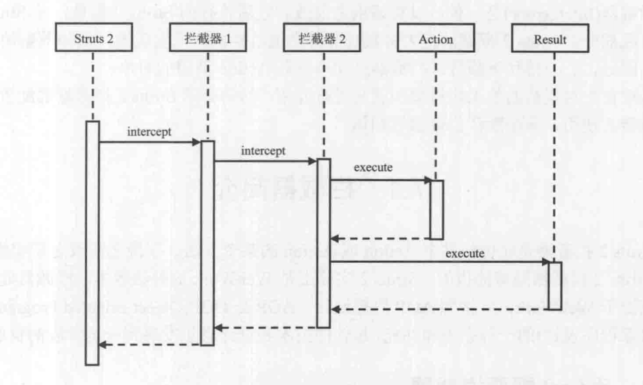

# Interceptor(拦截器器)
在请求之前或者请求之后执行的主键。
## Code
```
git checkout ch4
```
## a simple interceptor
a simple interceptor ,calculation an Action execute time.
### The Interceptor
TimeInterceptor.java
```java
public class TimeInterceptor extends AbstractInterceptor{
    public String intercept(ActionInvocation invocation) throws Exception {
        //记录系统当前时间
        long start = System.currentTimeMillis();
        System.out.println("Action开始 " + start );
        //Acion执行之前的操作
        String result = invocation.invoke();
        //Action执行后的操作
        //记录系统当前时间
        long end = System.currentTimeMillis();
        System.out.println("Action结束 " + end);
        //计算Action执行时间
        long time = end - start;
        System.out.println("Action执行时间 " + time + " ms ");
        return result;
    }
}
```
### The struts.xml
```xml
<package name="default" namespace="/" extends="struts-default">
    <!-- 定义拦截器-->
    <interceptors>
        <!-- name 指定拦截器的名字 class指定拦截器对应的类,拦截器具体实现-->
        <interceptor name="TimeInterceptor" class="me.caofeng.interceptor.TimeInterceptor"/>
    </interceptors>
        <!-- 配置动作 name指定动作的名称，在jsp或html中读访问的地址，class指定动作的实现类-->
    <action name="HelloAction" class="me.caofeng.actions.HelloAction">
        <!-- 实现逻辑视图和物理视图的映射 action要返回一个字符串，name指定接收的字符串名字，
        如果返回的结果和name匹配，则将相应的jsp页面返回个客户端-->
        <result name="success">/hello.jsp</result>
        <!-- 使用Struts2 默认拦截器，Struts2有很多默认拦截器，而且Struts2的很多工作都是由拦截器实现的-->
        <interceptor-ref name="defaultStack"/>
        <!-- 应用自定义的拦截器 -->
        <interceptor-ref name="TimeInterceptor"/>
    </action>
</package>
```
## 工作原理

拦截器在Action执行前或者Action执行后执行，和Servlet中的Filter类似。Struts2开始执行请求，如果有配置由拦截器，执行拦截器,在intercept()方法类执行拦截逻辑，如果有多个拦截器，拦截器按链式调用，要在intercept()中调用invocation.invoke(),将控制权转交给下一个拦截器或者直接返回Result，终止用户请求。
## 拦截器配置
在struts.xml中配置拦截器，定义拦截器的语法如下
```xml
<interceptor name="InterceptorName" class="InterceptorClass"/>
```
使用拦截器，在package中使用拦截器
```xml
<package name="default" namespace="/" extends="struts-default">
    <!-- 定义拦截器-->
    <interceptors>
        <!-- name 指定拦截器的名字 class指定拦截器对应的类,拦截器具体实现-->
        <interceptor name="TimeInterceptor" class="me.caofeng.interceptor.TimeInterceptor"/>
    </interceptors>
        <!-- 配置动作 name指定动作的名称，在jsp或html中读访问的地址，class指定动作的实现类-->
    <action name="HelloAction" class="me.caofeng.actions.HelloAction">
        <!-- 实现逻辑视图和物理视图的映射 action要返回一个字符串，name指定接收的字符串名字，
        如果返回的结果和name匹配，则将相应的jsp页面返回个客户端-->
        <result name="success">/hello.jsp</result>
        <!-- 使用Struts2 默认拦截器，Struts2有很多默认拦截器，而且Struts2的很多工作都是由拦截器实现的-->
        <interceptor-ref name="defaultStack"/>
        <!-- 应用自定义的拦截器 -->
        <interceptor-ref name="TimeInterceptor"/>
    </action>
</package>
```
使用拦截器栈，多个拦截器在一起使用，完成一些列动作，将这些拦截器放在一起，就可以组成一个拦截器栈。定义拦截器栈的语法如下
```xml
<interceptors>
    <interceptor-stack name="SmallStack">
        <interceptor-ref name="defaultStack"/>
        <interceptor-ref name="TimeInterceptor"/>
        <interceptor-ref name="SecondInterceptor"/>
    </interceptor-stack>

    <!-- name 指定拦截器的名字 class指定拦截器对应的类,拦截器具体实现-->
    <interceptor name="TimeInterceptor" class="me.caofeng.interceptor.TimeInterceptor"/>
    <interceptor name="SecondInterceptor" class="me.caofeng.interceptor.SecondInterceptor"/>
</interceptors>
```
## Struts2 默认拦截器
Struts2设置了很多拦截器，用来完成不同的工作，比如将form表单中的数据传递给Action,在设置拦截器时，如果不指定拦截器，则默认使用系统设置的拦截器，如果自定义了拦截器，并且相使用默认的拦截器，则要在配置中文件中指定使用默认拦截器。
- 默认拦截器配置文件
```xml
<interceptors>
     <interceptor name="alias" class="com.opensymphony.xwork2.interceptor.AliasInterceptor"/>
     <interceptor name="autowiring" class="com.opensymphony.xwork2.spring.interceptor.ActionAutowiringInterceptor"/>
     <interceptor name="chain" class="com.opensymphony.xwork2.interceptor.ChainingInterceptor"/>
     <interceptor name="conversionError" class="org.apache.struts2.interceptor.StrutsConversionErrorInterceptor"/>
     <interceptor name="cookie" class="org.apache.struts2.interceptor.CookieInterceptor"/>
     <interceptor name="cookieProvider" class="org.apache.struts2.interceptor.CookieProviderInterceptor"/>
     <interceptor name="clearSession" class="org.apache.struts2.interceptor.ClearSessionInterceptor" />
     <interceptor name="createSession" class="org.apache.struts2.interceptor.CreateSessionInterceptor" />
     <interceptor name="debugging" class="org.apache.struts2.interceptor.debugging.DebuggingInterceptor" />
     <interceptor name="execAndWait" class="org.apache.struts2.interceptor.ExecuteAndWaitInterceptor"/>
     <interceptor name="exception" class="com.opensymphony.xwork2.interceptor.ExceptionMappingInterceptor"/>
     <interceptor name="fileUpload" class="org.apache.struts2.interceptor.FileUploadInterceptor"/>
     <interceptor name="i18n" class="com.opensymphony.xwork2.interceptor.I18nInterceptor"/>
     <interceptor name="logger" class="com.opensymphony.xwork2.interceptor.LoggingInterceptor"/>
     <interceptor name="modelDriven" class="com.opensymphony.xwork2.interceptor.ModelDrivenInterceptor"/>
     <interceptor name="scopedModelDriven" class="com.opensymphony.xwork2.interceptor.ScopedModelDrivenInterceptor"/>
     <interceptor name="params" class="com.opensymphony.xwork2.interceptor.ParametersInterceptor"/>
     <interceptor name="actionMappingParams" class="org.apache.struts2.interceptor.ActionMappingParametersInteceptor"/>
     <interceptor name="prepare" class="com.opensymphony.xwork2.interceptor.PrepareInterceptor"/>
     <interceptor name="staticParams" class="com.opensymphony.xwork2.interceptor.StaticParametersInterceptor"/>
     <interceptor name="scope" class="org.apache.struts2.interceptor.ScopeInterceptor"/>
     <interceptor name="servletConfig" class="org.apache.struts2.interceptor.ServletConfigInterceptor"/>
     <interceptor name="timer" class="com.opensymphony.xwork2.interceptor.TimerInterceptor"/>
     <interceptor name="token" class="org.apache.struts2.interceptor.TokenInterceptor"/>
     <interceptor name="tokenSession" class="org.apache.struts2.interceptor.TokenSessionStoreInterceptor"/>
     <interceptor name="validation" class="org.apache.struts2.interceptor.validation.AnnotationValidationInterceptor"/>
     <interceptor name="workflow" class="com.opensymphony.xwork2.interceptor.DefaultWorkflowInterceptor"/>
     <interceptor name="store" class="org.apache.struts2.interceptor.MessageStoreInterceptor" />
     <interceptor name="checkbox" class="org.apache.struts2.interceptor.CheckboxInterceptor" />
     <interceptor name="profiling" class="org.apache.struts2.interceptor.ProfilingActivationInterceptor" />
     <interceptor name="roles" class="org.apache.struts2.interceptor.RolesInterceptor" />
     <interceptor name="annotationWorkflow" class="com.opensymphony.xwork2.interceptor.annotations.AnnotationWorkflowInterceptor" />
     <interceptor name="multiselect" class="org.apache.struts2.interceptor.MultiselectInterceptor" />

     <!-- Basic stack -->
     <interceptor-stack name="basicStack">
         <interceptor-ref name="exception"/>
         <interceptor-ref name="servletConfig"/>
         <interceptor-ref name="prepare"/>
         <interceptor-ref name="checkbox"/>
         <interceptor-ref name="multiselect"/>
         <interceptor-ref name="actionMappingParams"/>
         <interceptor-ref name="params">
             <param name="excludeParams">dojo\..*,^struts\..*,^session\..*,^request\..*,^application\..*,^servlet(Request|Response)\..*,parameters\...*</param>
         </interceptor-ref>
         <interceptor-ref name="conversionError"/>
     </interceptor-stack>

     <!-- Sample validation and workflow stack -->
     <interceptor-stack name="validationWorkflowStack">
         <interceptor-ref name="basicStack"/>
         <interceptor-ref name="validation"/>
         <interceptor-ref name="workflow"/>
     </interceptor-stack>

     <!-- Sample file upload stack -->
     <interceptor-stack name="fileUploadStack">
         <interceptor-ref name="fileUpload"/>
         <interceptor-ref name="basicStack"/>
     </interceptor-stack>

     <!-- Sample model-driven stack  -->
     <interceptor-stack name="modelDrivenStack">
         <interceptor-ref name="modelDriven"/>
         <interceptor-ref name="basicStack"/>
     </interceptor-stack>

     <!-- Sample action chaining stack -->
     <interceptor-stack name="chainStack">
         <interceptor-ref name="chain"/>
         <interceptor-ref name="basicStack"/>
     </interceptor-stack>

     <!-- Sample i18n stack -->
     <interceptor-stack name="i18nStack">
         <interceptor-ref name="i18n"/>
         <interceptor-ref name="basicStack"/>
     </interceptor-stack>

     <!-- An example of the paramsPrepareParams trick. This stack
          is exactly the same as the defaultStack, except that it
          includes one extra interceptor before the prepare interceptor:
          the params interceptor.

          This is useful for when you wish to apply parameters directly
          to an object that you wish to load externally (such as a DAO
          or database or service layer), but can't load that object
          until at least the ID parameter has been loaded. By loading
          the parameters twice, you can retrieve the object in the
          prepare() method, allowing the second params interceptor to
          apply the values on the object. -->
     <interceptor-stack name="paramsPrepareParamsStack">
         <interceptor-ref name="exception"/>
         <interceptor-ref name="alias"/>
         <interceptor-ref name="i18n"/>
         <interceptor-ref name="checkbox"/>
         <interceptor-ref name="multiselect"/>
         <interceptor-ref name="params">
             <param name="excludeParams">dojo\..*,^struts\..*,^session\..*,^request\..*,^application\..*,^servlet(Request|Response)\..*,parameters\...*</param>
         </interceptor-ref>
         <interceptor-ref name="servletConfig"/>
         <interceptor-ref name="prepare"/>
         <interceptor-ref name="chain"/>
         <interceptor-ref name="modelDriven"/>
         <interceptor-ref name="fileUpload"/>
         <interceptor-ref name="staticParams"/>
         <interceptor-ref name="actionMappingParams"/>
         <interceptor-ref name="params">
             <param name="excludeParams">dojo\..*,^struts\..*,^session\..*,^request\..*,^application\..*,^servlet(Request|Response)\..*,parameters\...*</param>
         </interceptor-ref>
         <interceptor-ref name="conversionError"/>
         <interceptor-ref name="validation">
             <param name="excludeMethods">input,back,cancel,browse</param>
         </interceptor-ref>
         <interceptor-ref name="workflow">
             <param name="excludeMethods">input,back,cancel,browse</param>
         </interceptor-ref>
     </interceptor-stack>

     <!-- A complete stack with all the common interceptors in place.
          Generally, this stack should be the one you use, though it
          may do more than you need. Also, the ordering can be
          switched around (ex: if you wish to have your servlet-related
          objects applied before prepare() is called, you'd need to move
          servletConfig interceptor up.

          This stack also excludes from the normal validation and workflow
          the method names input, back, and cancel. These typically are
          associated with requests that should not be validated.
          -->
     <interceptor-stack name="defaultStack">
         <interceptor-ref name="exception"/>
         <interceptor-ref name="alias"/>
         <interceptor-ref name="servletConfig"/>
         <interceptor-ref name="i18n"/>
         <interceptor-ref name="prepare"/>
         <interceptor-ref name="chain"/>
         <interceptor-ref name="scopedModelDriven"/>
         <interceptor-ref name="modelDriven"/>
         <interceptor-ref name="fileUpload"/>
         <interceptor-ref name="checkbox"/>
         <interceptor-ref name="multiselect"/>
         <interceptor-ref name="staticParams"/>
         <interceptor-ref name="actionMappingParams"/>
         <interceptor-ref name="params">
             <param name="excludeParams">dojo\..*,^struts\..*,^session\..*,^request\..*,^application\..*,^servlet(Request|Response)\..*,parameters\...*</param>
         </interceptor-ref>
         <interceptor-ref name="conversionError"/>
         <interceptor-ref name="validation">
             <param name="excludeMethods">input,back,cancel,browse</param>
         </interceptor-ref>
         <interceptor-ref name="workflow">
             <param name="excludeMethods">input,back,cancel,browse</param>
         </interceptor-ref>
         <interceptor-ref name="debugging"/>
     </interceptor-stack>

     <!-- The completeStack is here for backwards compatibility for
          applications that still refer to the defaultStack by the
          old name -->
     <interceptor-stack name="completeStack">
         <interceptor-ref name="defaultStack"/>
     </interceptor-stack>

     <!-- Sample execute and wait stack.
          Note: execAndWait should always be the *last* interceptor. -->
     <interceptor-stack name="executeAndWaitStack">
         <interceptor-ref name="execAndWait">
             <param name="excludeMethods">input,back,cancel</param>
         </interceptor-ref>
         <interceptor-ref name="defaultStack"/>
         <interceptor-ref name="execAndWait">
             <param name="excludeMethods">input,back,cancel</param>
         </interceptor-ref>
     </interceptor-stack>

</interceptors>

 <default-interceptor-ref name="defaultStack"/>
```
## 自定义拦截器
拦截器实例见代码
### 实现Interceptor接口
Interceptor接口如下
```java
public interface Interceptor extends Serializable {

    /**
     * Called to let an interceptor clean up any resources it has allocated.
     */
    void destroy();

    /**
     * Called after an interceptor is created, but before any requests are processed using
     * {@link #intercept(com.opensymphony.xwork2.ActionInvocation) intercept} , giving
     * the Interceptor a chance to initialize any needed resources.
     */
    void init();

    /**
     * Allows the Interceptor to do some processing on the request before and/or after the rest of the processing of the
     * request by the {@link ActionInvocation} or to short-circuit the processing and just return a String return code.
     *
     * @param invocation the action invocation
     * @return the return code, either returned from {@link ActionInvocation#invoke()}, or from the interceptor itself.
     * @throws Exception any system-level error, as defined in {@link com.opensymphony.xwork2.Action#execute()}.
     */
    String intercept(ActionInvocation invocation) throws Exception;

}
```
- init()
初始化，只执行一次
- destroy()
销毁，只执行一次
- intercept()
拦截方法，执行拦截逻辑
### 继承AbstractInterceptor
AbstractInterceptor实现了Interceptor接口，代码如下
```java
public abstract class AbstractInterceptor implements Interceptor {

    /**
     * Does nothing
     */
    public void init() {
    }

    /**
     * Does nothing
     */
    public void destroy() {
    }


    /**
     * Override to handle interception
     */
    public abstract String intercept(ActionInvocation invocation) throws Exception;
}
```
## 对方法进行拦截
如果一个Action中有多个方法，默认情况下，拦截器会拦截Action里所有的方法，可以设置拦截器只拦截部分方法，而不是拦截全部方法。要拦截部分方法，则要继承MethodFilterInterceptor。
### 配置拦截器
主要在struts.xml对拦截器进行设置，设置需要拦截的方法，在interceptor的配置中增加excludeMethods属性指定不拦截的方法或者includeMethods属性指定拦截的方法。
```xml
<interceptor-ref name="MethodInterceptor">
  <param name="includeMethods|includeMethods">method  name</param>
</interceptor-ref>
```
### 实例
- Interceptor
```java
public class MethodInterceptor extends MethodFilterInterceptor {
    @Override
    protected String doIntercept(ActionInvocation invocation) throws Exception {
        HttpServletRequest request = ServletActionContext.getRequest();
        request.setAttribute("message"," message from interceptor " +Thread.currentThread());
        System.out.println("开始执行方法拦截器");
        String result = invocation.invoke();
        System.out.println("方法拦截器执行完毕");
        return result;
    }
}
```
- Action
```java
public class HelloAction extends ActionSupport{
    /**
     * @Description: 执行请求，返回处理结果
     */
    @Override
    public String execute() throws Exception {
        System.out.println(" process user request ");
        //表示处理成功
        return SUCCESS;
    }
    /**
     * @Description: 测试拦截部分方法，不拦截get()
    */
    public String get(){
        System.out.println("get() 不拦截");
        return SUCCESS;
    }

    public String update(){
        System.out.println("update(),拦截");
        return SUCCESS;
    }
}
```
- struts.xml
```xml
<package name="default" namespace="/" extends="struts-default">
      <!-- 定义拦截器-->
      <interceptors>
          <interceptor-stack name="SmallStack">
              <interceptor-ref name="defaultStack"/>
              <interceptor-ref name="TimeInterceptor"/>
              <interceptor-ref name="SecondInterceptor"/>
              <interceptor-ref name="MethodInterceptor">
                  <param name="includeMethods">update</param>
              </interceptor-ref>
          </interceptor-stack>

          <!-- name 指定拦截器的名字 class指定拦截器对应的类,拦截器具体实现-->
          <interceptor name="TimeInterceptor" class="me.caofeng.interceptor.TimeInterceptor"/>
          <interceptor name="SecondInterceptor" class="me.caofeng.interceptor.SecondInterceptor"/>
          <interceptor name="MethodInterceptor" class="me.caofeng.interceptor.MethodInterceptor"/>
      </interceptors>
      <!-- 配置动作 name指定动作的名称，在jsp或html中读访问的地址，class指定动作的实现类-->
      <action name="HelloAction" class="me.caofeng.actions.HelloAction">
          <!-- 实现逻辑视图和物理视图的映射 action要返回一个字符串，name指定接收的字符串名字，
          如果返回的结果和name匹配，则将相应的jsp页面返回个客户端-->
          <result name="success">/hello.jsp</result>
          <!-- 使用拦截器栈-->
          <interceptor-ref name="SmallStack"/>
      </action>

      <action name="GetAction" class="me.caofeng.actions.HelloAction" method="get">
          <result name="success">/hello.jsp</result>
          <interceptor-ref name="SmallStack"/>
      </action>

      <action name="UpdateAction" class="me.caofeng.actions.HelloAction" method="update">
          <result name="success">/hello.jsp</result>
          <interceptor-ref name="SmallStack"/>
      </action>

  </package>
```
